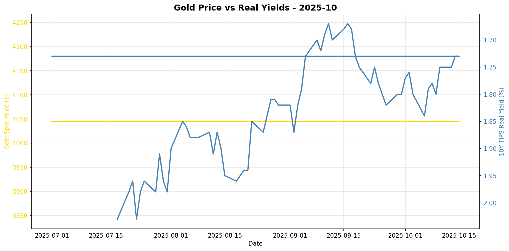
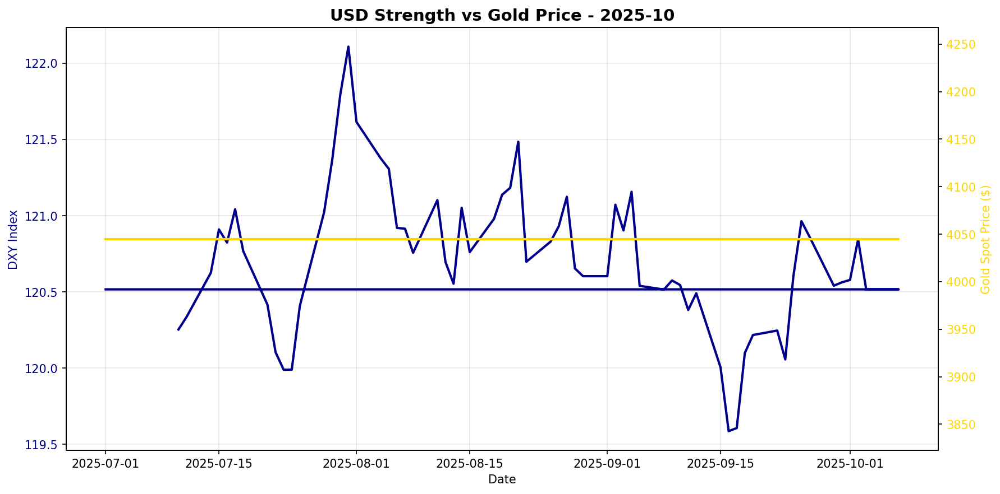

# Gold Market Monitor - October 2025

*Generated: 2025-10-09 12:09:41*

---

## Executive Summary

## Executive Summary

**Market Regime:** MILDLY BULLISH (Score: 2.75)

Over the past 30 days, real yields have fallen by 1.1%, while the US dollar has weakened by 0.1%. Gold spot prices decreased by 0.0% during this period.

**Key Drivers:**

✅ Real yields falling (+1.0)
✅ USD weakening (+0.8)
✅ Moderate CB buying (+1.0)

**Position Recommendation:** Maintain or slightly increase position

**Conviction Level:** Moderate conviction

Note: This is a fallback analysis. For more detailed insights, check OpenAI API configuration.


---

## Regime Score: 2.8 / 10


```
Bearish                Neutral                Bullish
   -5         -3         0         +3         +5
    ──────────┼────█─────
```


**Assessment:** MILDLY BULLISH  
**Conviction:** Moderate conviction  
**Recommended Action:** Maintain or slightly increase position

### Score Components:

  ✅ **Real yields falling**: +1.0
  ✅ **USD weakening**: +0.8
  ✅ **Moderate CB buying**: +1.0

**Methodology:**
- Real yields: ±2 points (primary driver)
- USD strength: ±1.5 points  
- Central bank buying: ±2 points
- Valuation: -1 point if overextended (z-score > 1.5)

*Score interpretation: >+3 = high conviction bullish | -1 to +1 = neutral | <-3 = bearish*

---

## Key Metrics

### Real Interest Rates (Primary Gold Driver)
- **10Y TIPS Yield:** 1.79%
- **30-Day Change:** -1.10%
- **90-Day Change:** N/A
- **Interpretation:** Falling real yields = bullish for gold

### US Dollar Strength
- **DXY Index:** 120.52
- **30-Day Change:** -0.11%
- **90-Day Change:** N/A
- **Interpretation:** Weakening USD = bullish for gold

### Market Sentiment
- **VIX Index:** N/A
- **Geopolitical Risk Index:** 395.1
- **Environment:** Normal risk levels

### Gold Valuation
- **Gold Spot Price:** $4045.00
- **30-Day Return:** +0.00%
- **Real Gold Price (CPI-Adjusted):** $N/A
- **Real Gold Z-Score (5Y):** N/A
  - *Insufficient history for z-score*
- **Gold/S&P 500 Ratio:** 0.6024

### Investment Flows
- **GLD Shares Outstanding:** N/A
  - *Note: Changes in shares outstanding indicate net ETF inflows/outflows*
- **Breakeven Inflation:** 2.35%

---

## Central Bank Activity (Official Sector)

- **Latest Quarter:** Q2_2025
- **Net Purchases:** 166.5 tonnes
- **Source:** WGC
- **Last Updated:** 2025-10-08 00:00:00 ✅
- **Interpretation:** Moderate buying

**Context:** Central banks have been consistent net buyers since 2010, with accelerated purchases post-2022. This represents structural, long-term demand often tied to reserve diversification and de-dollarization efforts.

---


## Charts





---

## Data Sources & Quality

**Primary Sources:**
- Real yields, gold spot, DXY, S&P 500, CPI, GPR: [Federal Reserve Economic Data (FRED)](https://fred.stlouisfed.org/)
- VIX, ETF holdings: [Yahoo Finance](https://finance.yahoo.com/)
- Central bank purchases: [World Gold Council](https://www.gold.org/goldhub/research/gold-demand-trends)

**Data Window:**
- Start: 2025-07-01 00:00:00
- End: 2025-10-07 00:00:00
- Days: 98

**Calculation Date:** 2025-10-09 12:09:40.033657

---

## Notes

- This report is generated automatically for monthly position review
- Focus on sustained regime changes, not daily volatility
- Z-scores require 1+ years of history (5 years optimal)
- Central bank data updates quarterly with ~45-60 day lag
- For questions or issues, review logs or contact the maintainer

---

*Report generated by Gold Market Monitor v1.0*
*GitHub: [esseedoubleyou/goldmonitor](https://github.com/esseedoubleyou/goldmonitor)*
