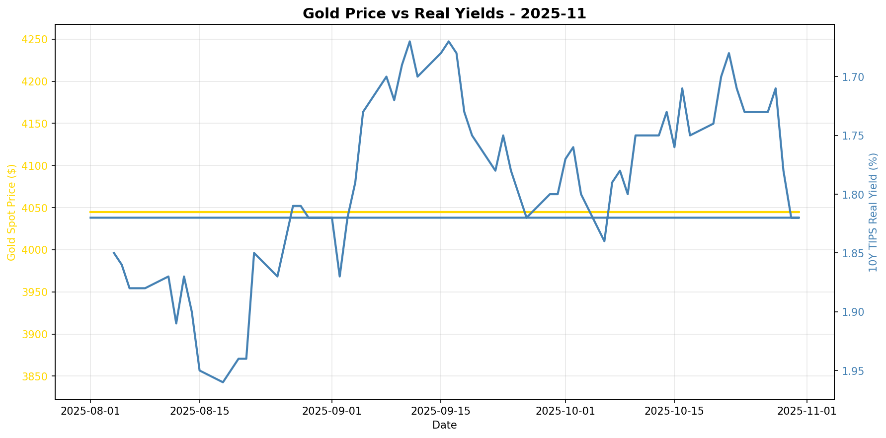
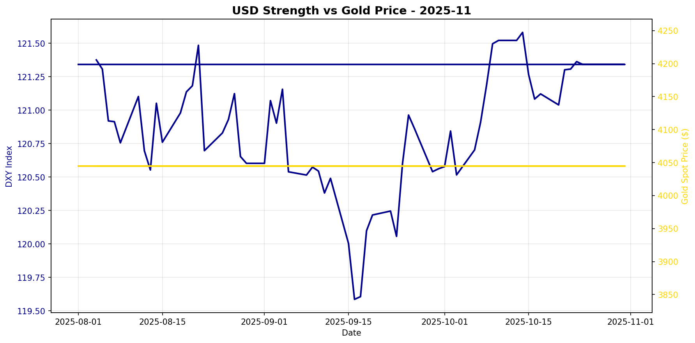

# Gold Market Monitor - November 2025

*Generated: 2025-11-01 09:25:19*

---

## Executive Summary

**1. What Changed:** In the past 30 days, the most significant shift has been the decline in real interest rates, with the 10-year TIPS yield dropping by 1.09%. This decrease in real yields is typically bullish for gold. However, the US Dollar Index (DXY) has strengthened by 0.69%, which is generally bearish for gold. Despite the strengthening dollar, gold has continued to rally, indicating a potential decoupling or anomaly in the usual inverse correlation between gold and the dollar.

**2. Why It Matters:** The decline in real interest rates suggests a favorable environment for gold, as lower real yields decrease the opportunity cost of holding non-yielding assets like gold. This is amplified by moderate central bank purchases, which continue to provide a supportive backdrop for gold prices. The strengthening US dollar, however, presents a headwind, potentially limiting gold's upside. The combination of these factors indicates a mildly bullish regime for gold, where the impact of falling real yields and central bank buying outweighs the negative pressure from a stronger dollar.

**3. Position Implications:** Given the regime score of 1.25, which indicates a moderately bullish outlook, it is advisable to maintain or slightly increase gold positions. The conviction level is moderate, suggesting that while there is potential for further gains, caution is warranted due to the USD strength. Investors should monitor key risks, such as any unexpected shifts in central bank policies or sharp movements in the dollar, which could alter the current regime dynamics. Staying alert to changes in geopolitical risks or broader market sentiment could also provide signals for future adjustments.

---

## Regime Score: 1.2 / 10


```
Bearish                Neutral                Bullish
   -5         -3         0         +3         +5
    ──────────┼─█────────
```


**Assessment:** MILDLY BULLISH  
**Conviction:** Moderate conviction  
**Recommended Action:** Maintain or slightly increase position

### Score Components:

  ✅ **Real yields falling**: +1.0
  ❌ **USD strengthening**: -0.8
  ✅ **Moderate CB buying**: +1.0

**Methodology:**
- Real yields: ±2 points (primary driver)
- USD strength: ±1.5 points  
- Central bank buying: ±2 points
- Valuation: -1 point if overextended (z-score > 1.5)

*Score interpretation: >+3 = high conviction bullish | -1 to +1 = neutral | <-3 = bearish*

---

## Key Metrics

### Real Interest Rates (Primary Gold Driver)
- **10Y TIPS Yield:** 1.82%
- **30-Day Change:** -1.09%
- **90-Day Change:** +7.06%
- **Interpretation:** Falling real yields = bullish for gold

### US Dollar Strength
- **DXY Index:** 121.34
- **30-Day Change:** +0.69%
- **90-Day Change:** +0.69%
- **Interpretation:** Strengthening USD = bearish for gold

### Market Sentiment
- **VIX Index:** N/A
- **Geopolitical Risk Index:** 291.1
- **Environment:** Normal risk levels

### Gold Valuation
- **Gold Spot Price:** $4045.00
- **30-Day Return:** +2.44%
- **Real Gold Price (CPI-Adjusted):** $4017.12
- **Real Gold Z-Score (5Y):** N/A
  - *Insufficient history for z-score*
- **Gold/S&P 500 Ratio:** 0.5914

### Investment Flows
- **GLD Shares Outstanding:** N/A
  - *Note: Changes in shares outstanding indicate net ETF inflows/outflows*
- **Breakeven Inflation:** 2.29%

---

## Central Bank Activity (Official Sector)

- **Latest Quarter:** Q2_2025
- **Net Purchases:** 166.5 tonnes
- **Source:** WGC
- **Last Updated:** 2025-10-08 00:00:00 ✅
- **Interpretation:** Moderate buying

**Context:** Central banks have been consistent net buyers since 2010, with accelerated purchases post-2022. This represents structural, long-term demand often tied to reserve diversification and de-dollarization efforts.

---


## Charts





---

## Data Sources & Quality

**Primary Sources:**
- Real yields, gold spot, DXY, S&P 500, CPI, GPR: [Federal Reserve Economic Data (FRED)](https://fred.stlouisfed.org/)
- VIX, ETF holdings: [Yahoo Finance](https://finance.yahoo.com/)
- Central bank purchases: [World Gold Council](https://www.gold.org/goldhub/research/gold-demand-trends)

**Data Window:**
- Start: 2025-07-01 00:00:00
- End: 2025-10-31 00:00:00
- Days: 122

**Calculation Date:** 2025-11-01 09:25:14.532813

---

## Notes

- This report is generated automatically for monthly position review
- Focus on sustained regime changes, not daily volatility
- Z-scores require 1+ years of history (5 years optimal)
- Central bank data updates quarterly with ~45-60 day lag
- For questions or issues, review logs or contact the maintainer

---

*Report generated by Gold Market Monitor v1.0*
*GitHub: [esseedoubleyou/goldmonitor](https://github.com/esseedoubleyou/goldmonitor)*
