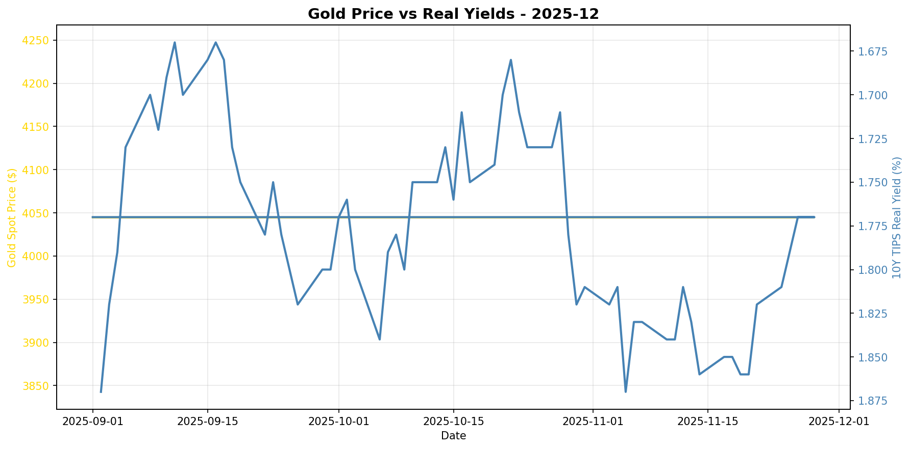
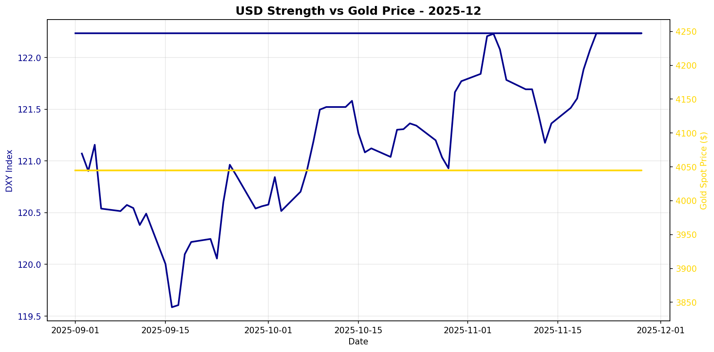

# Gold Market Monitor - December 2025

*Generated: 2025-12-01 09:37:40*

---

## Executive Summary

**1. What Changed:**
Over the past 30 days, the most significant trend shifts include a sharp increase in real interest rates, with the 10Y TIPS yield rising by 2.31%, a development that is typically bearish for gold prices. Concurrently, the US dollar has strengthened modestly by 0.74%, further exerting downward pressure on gold. Despite these headwinds, gold prices have remained flat over the past month, indicating a potential disconnect or anomaly between traditional drivers and recent price behavior.

**2. Why It Matters:**
The macroeconomic environment is currently characterized by rising real yields and a strengthening dollar, both of which are fundamental bearish drivers for gold. These factors typically increase the opportunity cost of holding non-yielding assets like gold. However, central bank moderate purchases and geopolitical uncertainties, albeit not immediately quantified, may provide some underlying support. The observed stability in gold prices, despite these negative pressures, suggests potential resilience or market positioning that offsets macro headwinds, but this does not imply structural shifts that would support sustained rallies.

**3. Position Implications:**
Given the regime score of -1.75, which indicates a mildly bearish outlook, the recommendation is to maintain or reduce exposure to gold. The conviction level for reducing exposure is moderate, as the primary drivers are aligned against gold. Key risks to monitor include any significant changes in central bank purchasing behavior or unexpected geopolitical developments that could shift sentiment. Additionally, a reversal in real yield trends or a weakening of the US dollar could alter the bearish outlook and provide a basis for reassessing the position. For now, the prudent course is to cautiously manage exposure, aligning with the current macroeconomic signals.

---

## Regime Score: -1.8 / 10


```
Bearish                Neutral                Bullish
   -5         -3         0         +3         +5
    ──────█───┼──────────
```


**Assessment:** MILDLY BEARISH  
**Conviction:** Caution warranted  
**Recommended Action:** Maintain or reduce exposure

### Score Components:

  ❌ **Real yields rising sharply**: -2.0
  ❌ **USD strengthening**: -0.8
  ✅ **Moderate CB buying**: +1.0

**Methodology:**
- Real yields: ±2 points (primary driver)
- USD strength: ±1.5 points  
- Central bank buying: ±2 points
- Valuation: -1 point if overextended (z-score > 1.5)

*Score interpretation: >+3 = high conviction bullish | -1 to +1 = neutral | <-3 = bearish*

---

## Key Metrics

### Real Interest Rates (Primary Gold Driver)
- **10Y TIPS Yield:** 1.77%
- **30-Day Change:** +2.31%
- **90-Day Change:** -1.67%
- **Interpretation:** Rising real yields = bearish for gold

### US Dollar Strength
- **DXY Index:** 122.23
- **30-Day Change:** +0.74%
- **90-Day Change:** +1.41%
- **Interpretation:** Strengthening USD = bearish for gold

### Market Sentiment
- **VIX Index:** N/A
- **Geopolitical Risk Index:** N/A
- **Environment:** Normal risk levels

### Gold Valuation
- **Gold Spot Price:** $4045.00
- **30-Day Return:** +0.00%
- **Real Gold Price (CPI-Adjusted):** $N/A
- **Real Gold Z-Score (5Y):** N/A
  - *Insufficient history for z-score*
- **Gold/S&P 500 Ratio:** 0.5906

### Investment Flows
- **GLD Shares Outstanding:** N/A
  - *Note: Changes in shares outstanding indicate net ETF inflows/outflows*
- **Breakeven Inflation:** 2.23%

---

## Central Bank Activity (Official Sector)

- **Latest Quarter:** Q2_2025
- **Net Purchases:** 166.5 tonnes
- **Source:** WGC
- **Last Updated:** 2025-10-08 00:00:00 ✅
- **Interpretation:** Moderate buying

**Context:** Central banks have been consistent net buyers since 2010, with accelerated purchases post-2022. This represents structural, long-term demand often tied to reserve diversification and de-dollarization efforts.

---


## Charts





---

## Data Sources & Quality

**Primary Sources:**
- Real yields, gold spot, DXY, S&P 500, CPI, GPR: [Federal Reserve Economic Data (FRED)](https://fred.stlouisfed.org/)
- VIX, ETF holdings: [Yahoo Finance](https://finance.yahoo.com/)
- Central bank purchases: [World Gold Council](https://www.gold.org/goldhub/research/gold-demand-trends)

**Data Window:**
- Start: 2025-07-01 00:00:00
- End: 2025-11-28 00:00:00
- Days: 150

**Calculation Date:** 2025-12-01 09:37:33.672226

---

## Notes

- This report is generated automatically for monthly position review
- Focus on sustained regime changes, not daily volatility
- Z-scores require 1+ years of history (5 years optimal)
- Central bank data updates quarterly with ~45-60 day lag
- For questions or issues, review logs or contact the maintainer

---

*Report generated by Gold Market Monitor v1.0*
*GitHub: [esseedoubleyou/goldmonitor](https://github.com/esseedoubleyou/goldmonitor)*
