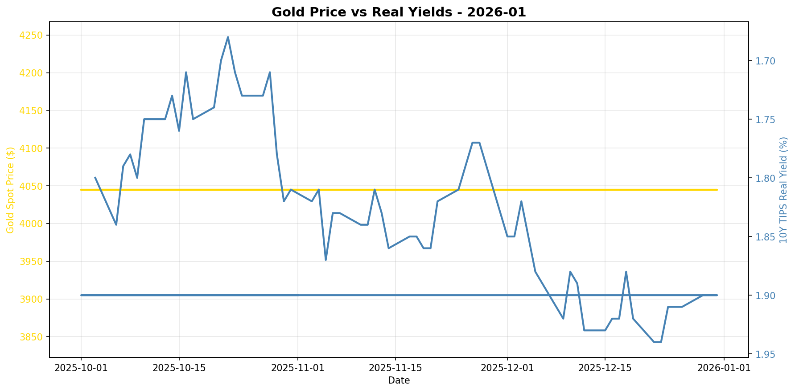
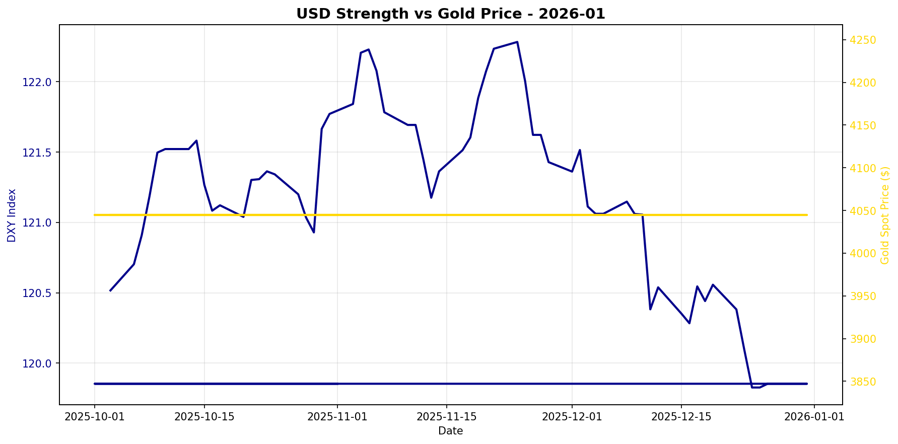

# Gold Market Monitor - January 2026

*Generated: 2026-01-01 09:33:42*

---

## Executive Summary

**1. What Changed**

Over the past 30 days, the most notable trend shift is the continued rise in real interest rates, with the 10-year TIPS yield increasing by 4.97%. This upward trajectory in real yields is typically bearish for gold as it increases the opportunity cost of holding non-yielding assets like gold. Conversely, the US dollar has shown signs of weakening, with the DXY index down by 1.95% in the same period, which is traditionally supportive of gold prices. Despite these counteracting forces, gold prices have stabilized, indicating a possible decoupling from rising yields, which could be influenced by other factors such as central bank purchasing activity.

**2. Why It Matters**

The macro regime currently presents mixed signals for gold. The sharp rise in real yields is a structural factor that generally suppresses gold demand, as higher real returns from bonds make gold less attractive. However, the weakening of the US dollar can offer a supportive backdrop, as a cheaper dollar makes gold less expensive for foreign buyers. Additionally, central banks have continued moderate buying, which provides a buffer against the negative impact of rising yields. These conflicting drivers suggest that while there is pressure on gold from a fundamental perspective, the market is not reacting as strongly to these pressures, possibly due to the mitigating effects of currency movements and central bank actions.

**3. Position Implications**

Given the regime score of -0.25, which reflects a neutral stance, the current environment warrants holding the existing position in gold. The mixed signals from rising real yields and a weakening dollar suggest a lack of clear directional momentum. While the upward pressure on yields poses a downside risk, the weakening dollar and ongoing central bank purchases provide a degree of support. Investors should monitor the trajectory of real yields closely, as a continued rise could further pressure gold prices, and watch for any significant shifts in central bank buying patterns or geopolitical developments that might alter the risk environment. Overall, the current setup lacks a strong conviction to initiate new positions or exit existing ones.

---

## Regime Score: -0.2 / 10


```
Bearish                Neutral                Bullish
   -5         -3         0         +3         +5
    ─────────█┼──────────
```


**Assessment:** NEUTRAL  
**Conviction:** Mixed signals  
**Recommended Action:** Hold current position

### Score Components:

  ❌ **Real yields rising sharply**: -2.0
  ✅ **USD weakening**: +0.8
  ✅ **Moderate CB buying**: +1.0

**Methodology:**
- Real yields: ±2 points (primary driver)
- USD strength: ±1.5 points  
- Central bank buying: ±2 points
- Valuation: -1 point if overextended (z-score > 1.5)

*Score interpretation: >+3 = high conviction bullish | -1 to +1 = neutral | <-3 = bearish*

---

## Key Metrics

### Real Interest Rates (Primary Gold Driver)
- **10Y TIPS Yield:** 1.90%
- **30-Day Change:** +4.97%
- **90-Day Change:** +6.15%
- **Interpretation:** Rising real yields = bearish for gold

### US Dollar Strength
- **DXY Index:** 119.85
- **30-Day Change:** -1.95%
- **90-Day Change:** -0.55%
- **Interpretation:** Weakening USD = bullish for gold

### Market Sentiment
- **VIX Index:** N/A
- **Geopolitical Risk Index:** N/A
- **Environment:** Normal risk levels

### Gold Valuation
- **Gold Spot Price:** $4045.00
- **30-Day Return:** +0.00%
- **Real Gold Price (CPI-Adjusted):** $N/A
- **Real Gold Z-Score (5Y):** N/A
  - *Insufficient history for z-score*
- **Gold/S&P 500 Ratio:** 0.5909

### Investment Flows
- **GLD Shares Outstanding:** N/A
  - *Note: Changes in shares outstanding indicate net ETF inflows/outflows*
- **Breakeven Inflation:** 2.24%

---

## Central Bank Activity (Official Sector)

- **Latest Quarter:** Q2_2025
- **Net Purchases:** 166.5 tonnes
- **Source:** WGC
- **Last Updated:** 2025-10-08 00:00:00 ✅
- **Interpretation:** Moderate buying

**Context:** Central banks have been consistent net buyers since 2010, with accelerated purchases post-2022. This represents structural, long-term demand often tied to reserve diversification and de-dollarization efforts.

---


## Charts





---

## Data Sources & Quality

**Primary Sources:**
- Real yields, gold spot, DXY, S&P 500, CPI, GPR: [Federal Reserve Economic Data (FRED)](https://fred.stlouisfed.org/)
- VIX, ETF holdings: [Yahoo Finance](https://finance.yahoo.com/)
- Central bank purchases: [World Gold Council](https://www.gold.org/goldhub/research/gold-demand-trends)

**Data Window:**
- Start: 2025-07-01 00:00:00
- End: 2025-12-31 00:00:00
- Days: 183

**Calculation Date:** 2026-01-01 09:33:37.117362

---

## Notes

- This report is generated automatically for monthly position review
- Focus on sustained regime changes, not daily volatility
- Z-scores require 1+ years of history (5 years optimal)
- Central bank data updates quarterly with ~45-60 day lag
- For questions or issues, review logs or contact the maintainer

---

*Report generated by Gold Market Monitor v1.0*
*GitHub: [esseedoubleyou/goldmonitor](https://github.com/esseedoubleyou/goldmonitor)*
