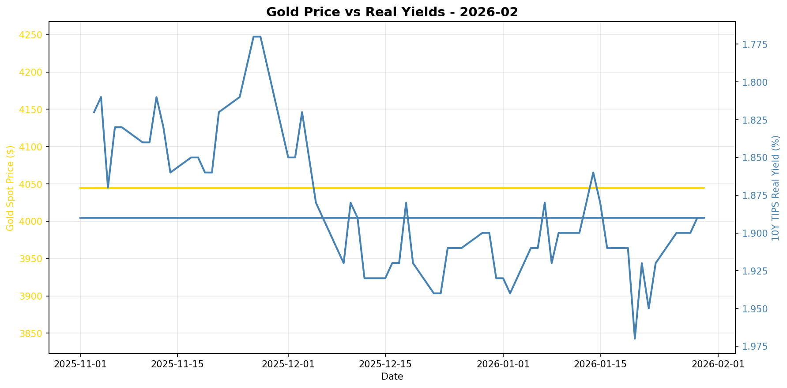
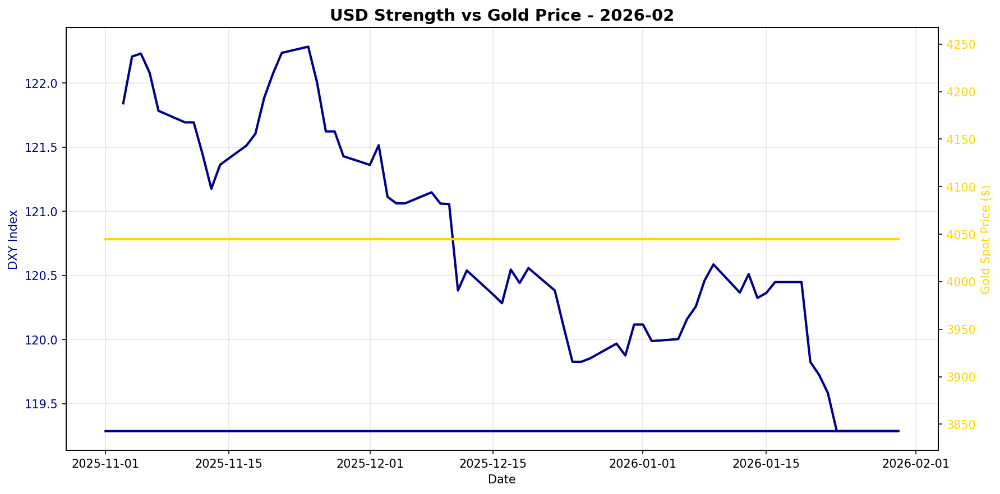

# Gold Market Monitor - February 2026

*Generated: 2026-02-01 09:39:46*

---

## Executive Summary

**1. What Changed**

In the past 30 days, the most significant trend shift has been a notable decline in the 10-year TIPS yield, which fell by 1.05%, indicating a more accommodative real interest rate environment. Concurrently, the US dollar index (DXY) has weakened by 0.45%, adding further bullish momentum for gold. Despite these positive signals for gold, relative performance metrics show that gold has remained flat over the month, with the Gold/S&P 500 ratio suggesting that equities have outperformed gold in this period.

**2. Why It Matters**

The decline in real interest rates is a crucial driver for gold, as lower yields reduce the opportunity cost of holding non-yielding assets like gold. The weakening of the US dollar further enhances gold's appeal as a store of value and a hedge against currency depreciation. Although central bank data is stale, previous moderate buying indicates a supportive backdrop. These factors suggest a macro environment that is favorable for gold, characterized by falling real yields and a softer dollar, which are structural shifts rather than cyclical noise.

**3. Position Implications**

Given the regime score of 1.75, which indicates a mildly bullish outlook, the current environment supports maintaining or slightly increasing a long position in gold. The combination of falling real yields and weakening dollar outweighs the lack of recent central bank data, providing a moderate conviction to adjust positions. Investors should monitor any reversal in real yield trends or unexpected strength in the US dollar, as these could pose risks to the bullish thesis. Overall, the actionable strategy is to capitalize on the current favorable conditions by reinforcing gold positions, aware of the potential for shifts in fundamental drivers.

---

## Regime Score: 1.8 / 10


```
Bearish                Neutral                Bullish
   -5         -3         0         +3         +5
    ──────────┼──█───────
```


**Assessment:** MILDLY BULLISH  
**Conviction:** Moderate conviction  
**Recommended Action:** Maintain or slightly increase position

### Score Components:

  ✅ **Real yields falling**: +1.0
  ✅ **USD weakening**: +0.8
  ⚠️ **CB data stale (116 days)**: +0.0

**Methodology:**
- Real yields: ±2 points (primary driver)
- USD strength: ±1.5 points  
- Central bank buying: ±2 points
- Valuation: -1 point if overextended (z-score > 1.5)

*Score interpretation: >+3 = high conviction bullish | -1 to +1 = neutral | <-3 = bearish*

---

## Key Metrics

### Real Interest Rates (Primary Gold Driver)
- **10Y TIPS Yield:** 1.89%
- **30-Day Change:** -1.05%
- **90-Day Change:** +3.85%
- **Interpretation:** Falling real yields = bullish for gold

### US Dollar Strength
- **DXY Index:** 119.29
- **30-Day Change:** -0.45%
- **90-Day Change:** -1.69%
- **Interpretation:** Weakening USD = bullish for gold

### Market Sentiment
- **VIX Index:** N/A
- **Geopolitical Risk Index:** N/A
- **Environment:** Normal risk levels

### Gold Valuation
- **Gold Spot Price:** $4045.00
- **30-Day Return:** +0.00%
- **Real Gold Price (CPI-Adjusted):** $3996.64
- **Real Gold Z-Score (5Y):** N/A
  - *Insufficient history for z-score*
- **Gold/S&P 500 Ratio:** 0.5829

### Investment Flows
- **GLD Shares Outstanding:** N/A
  - *Note: Changes in shares outstanding indicate net ETF inflows/outflows*
- **Breakeven Inflation:** 2.35%

---

## Central Bank Activity (Official Sector)

- **Latest Quarter:** Q2_2025
- **Net Purchases:** 166.5 tonnes
- **Source:** WGC
- **Last Updated:** 2025-10-08 00:00:00 ⚠️

⚠️ **Data is 116 days old - check for new WGC report**
- **Interpretation:** Moderate buying

**Context:** Central banks have been consistent net buyers since 2010, with accelerated purchases post-2022. This represents structural, long-term demand often tied to reserve diversification and de-dollarization efforts.

---


## Charts





---

## Data Sources & Quality

**Primary Sources:**
- Real yields, gold spot, DXY, S&P 500, CPI, GPR: [Federal Reserve Economic Data (FRED)](https://fred.stlouisfed.org/)
- VIX, ETF holdings: [Yahoo Finance](https://finance.yahoo.com/)
- Central bank purchases: [World Gold Council](https://www.gold.org/goldhub/research/gold-demand-trends)

**Data Window:**
- Start: 2025-07-01 00:00:00
- End: 2026-01-30 00:00:00
- Days: 213

**Calculation Date:** 2026-02-01 09:39:41.199808

---

## Notes

- This report is generated automatically for monthly position review
- Focus on sustained regime changes, not daily volatility
- Z-scores require 1+ years of history (5 years optimal)
- Central bank data updates quarterly with ~45-60 day lag
- For questions or issues, review logs or contact the maintainer

---

*Report generated by Gold Market Monitor v1.0*
*GitHub: [esseedoubleyou/goldmonitor](https://github.com/esseedoubleyou/goldmonitor)*
