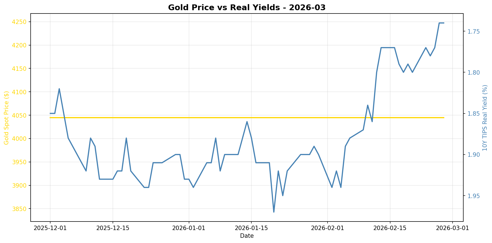
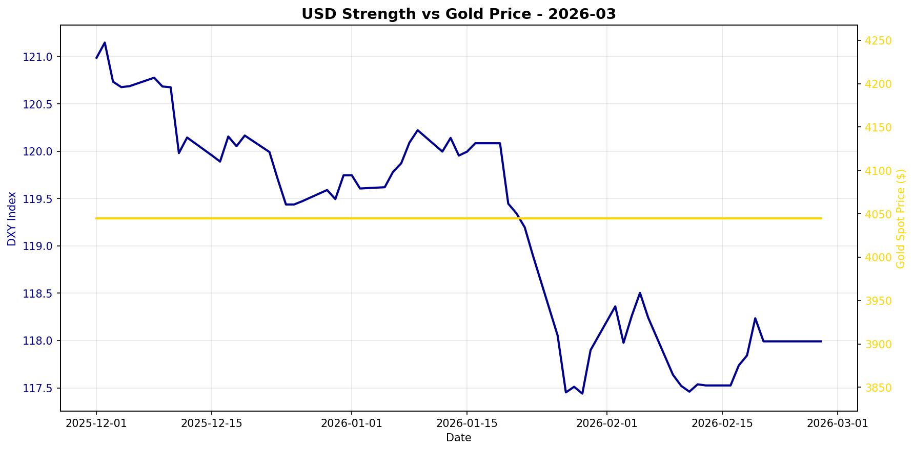

# Gold Market Monitor - March 2026

*Generated: 2026-03-01 09:38:39*

---

## Executive Summary

**1. What Changed**

Over the past 30 days, the most significant trend in the gold market has been the sharp decline in real interest rates, with the 10-year TIPS yield falling by 9.38%. Concurrently, the US Dollar Index (DXY) has weakened by 1.08%. These shifts indicate a supportive environment for gold, as lower real yields reduce the opportunity cost of holding non-yielding assets like gold, while a weaker dollar makes gold cheaper for foreign buyers.

**2. Why It Matters**

The decline in real yields and the weakening dollar suggest a mildly bullish macroeconomic regime for gold. Falling real yields typically signal expectations of lower future growth and inflation, enhancing gold's appeal as a safe haven. Meanwhile, a weakening dollar reflects potential shifts in global capital flows and currency valuation dynamics, further supporting gold prices. The stale central bank purchase data is a minor concern but does not detract significantly from the current bullish indicators given the strength of the other drivers.

**3. Position Implications**

Given the regime score of 2.75, the recommendation is to maintain or slightly increase gold exposure. The conviction level is moderate, driven primarily by the sharp decline in real yields and the weakening dollar. Key risks to monitor include any abrupt changes in central bank policies or unexpected geopolitical events that could alter risk sentiment. Additionally, keep an eye on the upcoming release of updated central bank purchase data, as fresh information could impact the market's outlook. Overall, the current environment supports a cautiously optimistic stance on gold, favoring a slight position increase in line with the sustained bullish trends.

---

## Regime Score: 2.8 / 10


```
Bearish                Neutral                Bullish
   -5         -3         0         +3         +5
    ──────────┼────█─────
```


**Assessment:** MILDLY BULLISH  
**Conviction:** Moderate conviction  
**Recommended Action:** Maintain or slightly increase position

### Score Components:

  ✅ **Real yields falling sharply**: +2.0
  ✅ **USD weakening**: +0.8
  ⚠️ **CB data stale (144 days)**: +0.0

**Methodology:**
- Real yields: ±2 points (primary driver)
- USD strength: ±1.5 points  
- Central bank buying: ±2 points
- Valuation: -1 point if overextended (z-score > 1.5)

*Score interpretation: >+3 = high conviction bullish | -1 to +1 = neutral | <-3 = bearish*

---

## Key Metrics

### Real Interest Rates (Primary Gold Driver)
- **10Y TIPS Yield:** 1.74%
- **30-Day Change:** -9.38%
- **90-Day Change:** -9.38%
- **Interpretation:** Falling real yields = bullish for gold

### US Dollar Strength
- **DXY Index:** 117.99
- **30-Day Change:** -1.08%
- **90-Day Change:** -1.80%
- **Interpretation:** Weakening USD = bullish for gold

### Market Sentiment
- **VIX Index:** N/A
- **Geopolitical Risk Index:** N/A
- **Environment:** Normal risk levels

### Gold Valuation
- **Gold Spot Price:** $4045.00
- **30-Day Return:** +0.00%
- **Real Gold Price (CPI-Adjusted):** $3989.81
- **Real Gold Z-Score (5Y):** N/A
  - *Insufficient history for z-score*
- **Gold/S&P 500 Ratio:** 0.5880

### Investment Flows
- **GLD Shares Outstanding:** N/A
  - *Note: Changes in shares outstanding indicate net ETF inflows/outflows*
- **Breakeven Inflation:** 2.28%

---

## Central Bank Activity (Official Sector)

- **Latest Quarter:** Q2_2025
- **Net Purchases:** 166.5 tonnes
- **Source:** WGC
- **Last Updated:** 2025-10-08 00:00:00 ⚠️

⚠️ **Data is 144 days old - check for new WGC report**
- **Interpretation:** Moderate buying

**Context:** Central banks have been consistent net buyers since 2010, with accelerated purchases post-2022. This represents structural, long-term demand often tied to reserve diversification and de-dollarization efforts.

---


## Charts





---

## Data Sources & Quality

**Primary Sources:**
- Real yields, gold spot, DXY, S&P 500, CPI, GPR: [Federal Reserve Economic Data (FRED)](https://fred.stlouisfed.org/)
- VIX, ETF holdings: [Yahoo Finance](https://finance.yahoo.com/)
- Central bank purchases: [World Gold Council](https://www.gold.org/goldhub/research/gold-demand-trends)

**Data Window:**
- Start: 2025-07-01 00:00:00
- End: 2026-02-27 00:00:00
- Days: 241

**Calculation Date:** 2026-03-01 09:38:34.304737

---

## Notes

- This report is generated automatically for monthly position review
- Focus on sustained regime changes, not daily volatility
- Z-scores require 1+ years of history (5 years optimal)
- Central bank data updates quarterly with ~45-60 day lag
- For questions or issues, review logs or contact the maintainer

---

*Report generated by Gold Market Monitor v1.0*
*GitHub: [esseedoubleyou/goldmonitor](https://github.com/esseedoubleyou/goldmonitor)*
