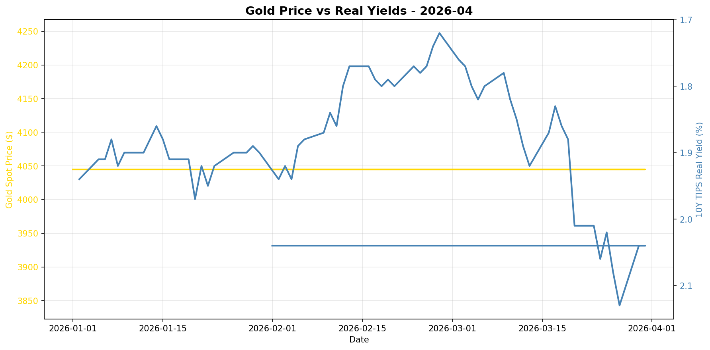
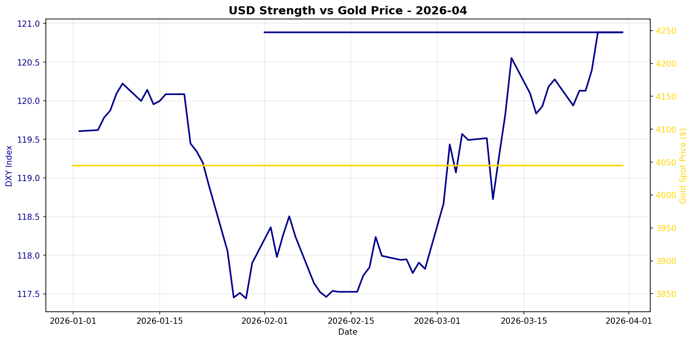

# Gold Market Monitor - April 2026

*Generated: 2026-04-01 10:12:37*

---

## Executive Summary

**1. What Changed:**  
In the past 30 days, there has been a significant increase in real interest rates, with the 10-year TIPS yield rising by 14.61%, which is a strong bearish indicator for gold. Concurrently, the US dollar has strengthened, with the DXY index increasing by 2.45%. Both of these factors typically exert downward pressure on gold prices, yet the gold price has remained static over the same period, which suggests a potential disconnect between gold's traditional drivers and its current pricing.

**2. Why It Matters:**  
The rise in real yields directly increases the opportunity cost of holding non-yielding assets like gold, making it less attractive relative to interest-bearing investments. Moreover, a stronger US dollar typically reduces the demand for gold as it becomes more expensive for holders of other currencies. These developments suggest a bearish macro regime for gold, driven by fundamental economic variables rather than transient market sentiment or geopolitical concerns. The stale central bank data further clouds the picture, but given the latest available data indicates moderate buying, it is likely insufficient to counteract the bearish pressure from real yields and dollar strength.

**3. Position Implications:**  
With a regime score of -3.5, the conviction for a bearish outlook on gold is high. The strong rise in real yields and dollar strength suggests a structurally challenging environment for gold, making a reduction in gold positions advisable. Investors should consider reallocating resources towards assets that benefit from rising yields and dollar strength. Key risks to monitor include any sudden geopolitical tensions or shifts in central bank activity that could provide unexpected support for gold prices. However, barring such catalysts, the dominant macroeconomic factors indicate a continuation of bearish conditions for gold in the near term.

---

## Regime Score: -3.5 / 10


```
Bearish                Neutral                Bullish
   -5         -3         0         +3         +5
    ───█──────┼──────────
```


**Assessment:** BEARISH  
**Conviction:** High conviction bearish  
**Recommended Action:** Consider reducing position

### Score Components:

  ❌ **Real yields rising sharply**: -2.0
  ❌ **USD strengthening sharply**: -1.5
  ⚠️ **CB data stale (175 days)**: +0.0

**Methodology:**
- Real yields: ±2 points (primary driver)
- USD strength: ±1.5 points  
- Central bank buying: ±2 points
- Valuation: -1 point if overextended (z-score > 1.5)

*Score interpretation: >+3 = high conviction bullish | -1 to +1 = neutral | <-3 = bearish*

---

## Key Metrics

### Real Interest Rates (Primary Gold Driver)
- **10Y TIPS Yield:** 2.04%
- **30-Day Change:** +14.61%
- **90-Day Change:** +7.37%
- **Interpretation:** Rising real yields = bearish for gold

### US Dollar Strength
- **DXY Index:** 120.89
- **30-Day Change:** +2.45%
- **90-Day Change:** +0.86%
- **Interpretation:** Strengthening USD = bearish for gold

### Market Sentiment
- **VIX Index:** N/A
- **Geopolitical Risk Index:** N/A
- **Environment:** Normal risk levels

### Gold Valuation
- **Gold Spot Price:** $4045.00
- **30-Day Return:** +0.00%
- **Real Gold Price (CPI-Adjusted):** $3989.81
- **Real Gold Z-Score (5Y):** 0.19
  - *Fair value range*
- **Gold/S&P 500 Ratio:** 0.6196

### Investment Flows
- **GLD Shares Outstanding:** N/A
  - *Note: Changes in shares outstanding indicate net ETF inflows/outflows*
- **Breakeven Inflation:** 2.31%

---

## Central Bank Activity (Official Sector)

- **Latest Quarter:** Q2_2025
- **Net Purchases:** 166.5 tonnes
- **Source:** WGC
- **Last Updated:** 2025-10-08 00:00:00 ⚠️

⚠️ **Data is 175 days old - check for new WGC report**
- **Interpretation:** Moderate buying

**Context:** Central banks have been consistent net buyers since 2010, with accelerated purchases post-2022. This represents structural, long-term demand often tied to reserve diversification and de-dollarization efforts.

---


## Charts





---

## Data Sources & Quality

**Primary Sources:**
- Real yields, gold spot, DXY, S&P 500, CPI, GPR: [Federal Reserve Economic Data (FRED)](https://fred.stlouisfed.org/)
- VIX, ETF holdings: [Yahoo Finance](https://finance.yahoo.com/)
- Central bank purchases: [World Gold Council](https://www.gold.org/goldhub/research/gold-demand-trends)

**Data Window:**
- Start: 2025-07-01 00:00:00
- End: 2026-03-31 00:00:00
- Days: 273

**Calculation Date:** 2026-04-01 10:12:29.628161

---

## Notes

- This report is generated automatically for monthly position review
- Focus on sustained regime changes, not daily volatility
- Z-scores require 1+ years of history (5 years optimal)
- Central bank data updates quarterly with ~45-60 day lag
- For questions or issues, review logs or contact the maintainer

---

*Report generated by Gold Market Monitor v1.0*
*GitHub: [esseedoubleyou/goldmonitor](https://github.com/esseedoubleyou/goldmonitor)*
