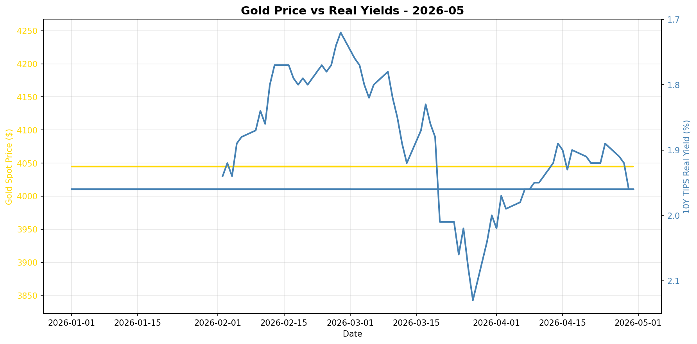
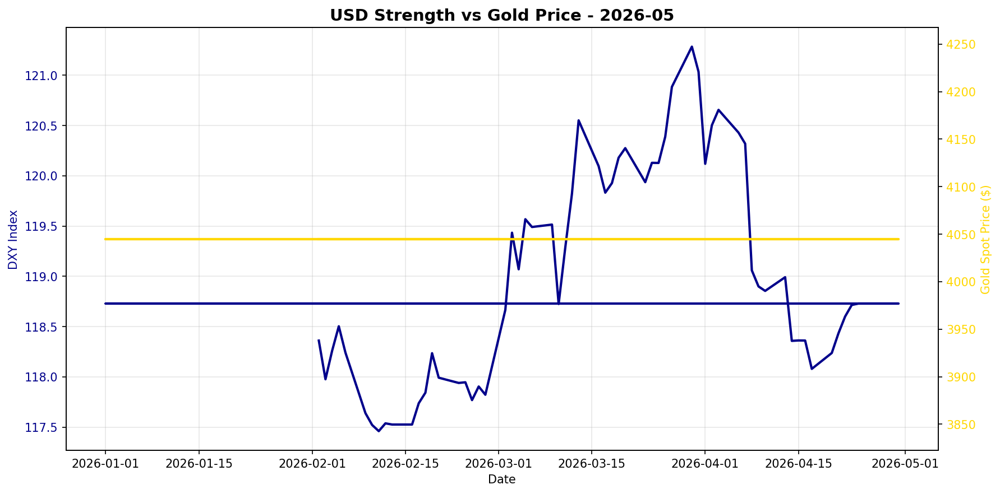

# Gold Market Monitor - May 2026

*Generated: 2026-05-01 10:40:01*

---

## Executive Summary

**1. What Changed:**  
In the past 30 days, the most significant trend shift is the notable decline in real interest rates, with the 10Y TIPS yield dropping by 5.77%. This represents a reversal from the previous 90-day rise of 9.50%, signaling a shift toward a more conducive environment for gold appreciation. Additionally, the US Dollar Index (DXY) has weakened by 1.38% over the same period, further supporting gold prices. These changes suggest a regime shift towards conditions more favorable for gold, with weakening real yields and a softer dollar driving the recent stabilization in gold's price near its high at $4045.00.

**2. Why It Matters:**  
The decline in real yields is critical as it lowers the opportunity cost of holding non-yielding assets like gold, directly enhancing its attractiveness. Simultaneously, a weakening USD typically boosts gold's appeal as a hedge and alternative asset, especially in global markets where gold is seen as a dollar-denominated safe haven. Despite the stale central bank data, which limits insights into ongoing institutional demand, the current macro environment suggests a mild bullish regime for gold. This indicates a structural shift towards a more supportive backdrop for gold, distinct from temporary cyclical fluctuations.

**3. Position Implications:**  
Based on the regime score of 2.75, which reflects a mildly bullish outlook, investors should consider maintaining or slightly increasing their gold positions. The moderate conviction level is supported by the convergence of falling real yields and a weakening dollar. Key risks to monitor include any reversal in real interest rates or sudden USD strength, which could undermine the current favorable regime. Additionally, updates on central bank activity could provide further directional cues, though current signals suggest a stable or slightly positive outlook for gold in the near term.

---

## Regime Score: 2.8 / 10


```
Bearish                Neutral                Bullish
   -5         -3         0         +3         +5
    ──────────┼────█─────
```


**Assessment:** MILDLY BULLISH  
**Conviction:** Moderate conviction  
**Recommended Action:** Maintain or slightly increase position

### Score Components:

  ✅ **Real yields falling sharply**: +2.0
  ✅ **USD weakening**: +0.8
  ⚠️ **CB data stale (205 days)**: +0.0

**Methodology:**
- Real yields: ±2 points (primary driver)
- USD strength: ±1.5 points  
- Central bank buying: ±2 points
- Valuation: -1 point if overextended (z-score > 1.5)

*Score interpretation: >+3 = high conviction bullish | -1 to +1 = neutral | <-3 = bearish*

---

## Key Metrics

### Real Interest Rates (Primary Gold Driver)
- **10Y TIPS Yield:** 1.96%
- **30-Day Change:** -5.77%
- **90-Day Change:** +9.50%
- **Interpretation:** Falling real yields = bullish for gold

### US Dollar Strength
- **DXY Index:** 118.73
- **30-Day Change:** -1.38%
- **90-Day Change:** +0.84%
- **Interpretation:** Weakening USD = bullish for gold

### Market Sentiment
- **VIX Index:** N/A
- **Geopolitical Risk Index:** N/A
- **Environment:** Normal risk levels

### Gold Valuation
- **Gold Spot Price:** $4045.00
- **30-Day Return:** +0.00%
- **Real Gold Price (CPI-Adjusted):** $N/A
- **Real Gold Z-Score (5Y):** N/A
  - *Insufficient history for z-score*
- **Gold/S&P 500 Ratio:** 0.5611

### Investment Flows
- **GLD Shares Outstanding:** N/A
  - *Note: Changes in shares outstanding indicate net ETF inflows/outflows*
- **Breakeven Inflation:** 2.46%

---

## Central Bank Activity (Official Sector)

- **Latest Quarter:** Q2_2025
- **Net Purchases:** 166.5 tonnes
- **Source:** WGC
- **Last Updated:** 2025-10-08 00:00:00 ⚠️

⚠️ **Data is 205 days old - check for new WGC report**
- **Interpretation:** Moderate buying

**Context:** Central banks have been consistent net buyers since 2010, with accelerated purchases post-2022. This represents structural, long-term demand often tied to reserve diversification and de-dollarization efforts.

---


## Charts





---

## Data Sources & Quality

**Primary Sources:**
- Real yields, gold spot, DXY, S&P 500, CPI, GPR: [Federal Reserve Economic Data (FRED)](https://fred.stlouisfed.org/)
- VIX, ETF holdings: [Yahoo Finance](https://finance.yahoo.com/)
- Central bank purchases: [World Gold Council](https://www.gold.org/goldhub/research/gold-demand-trends)

**Data Window:**
- Start: 2025-07-01 00:00:00
- End: 2026-04-30 00:00:00
- Days: 303

**Calculation Date:** 2026-05-01 10:39:56.009240

---

## Notes

- This report is generated automatically for monthly position review
- Focus on sustained regime changes, not daily volatility
- Z-scores require 1+ years of history (5 years optimal)
- Central bank data updates quarterly with ~45-60 day lag
- For questions or issues, review logs or contact the maintainer

---

*Report generated by Gold Market Monitor v1.0*
*GitHub: [esseedoubleyou/goldmonitor](https://github.com/esseedoubleyou/goldmonitor)*
