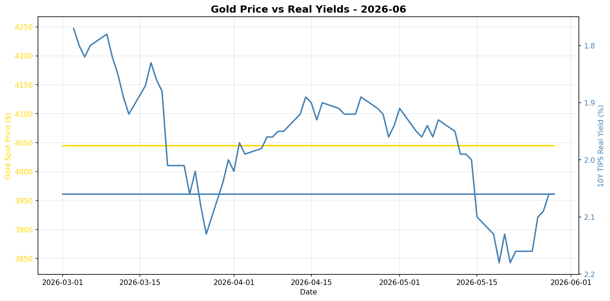
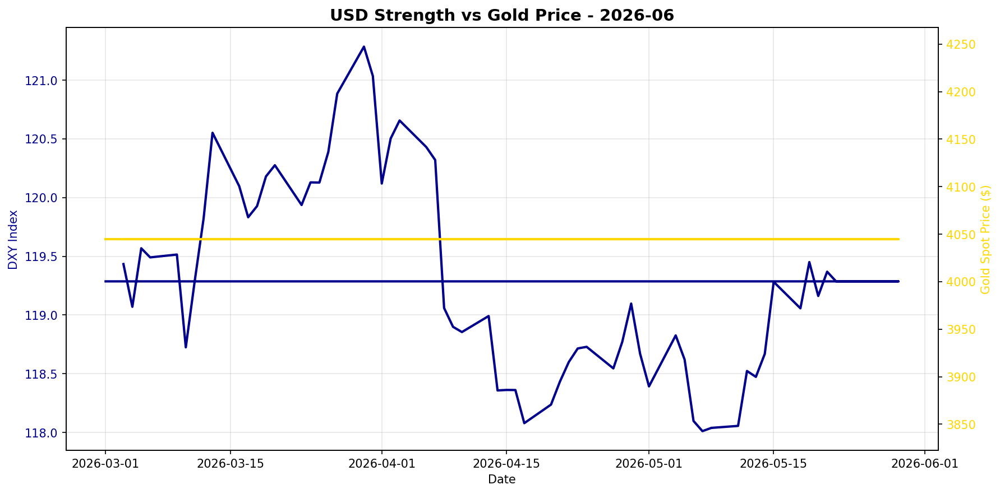

# Gold Market Monitor - June 2026

*Generated: 2026-06-01 15:30:33*

---

## Executive Summary

**1. What Changed**

In the past 30 days, the most notable developments are the continuation of rising real interest rates, with the 10Y TIPS yield increasing by 8.99%, and the US Dollar Index (DXY) experiencing a slight strengthening of 0.47%. The persistent upward trend in real yields is exerting significant downward pressure on gold prices, as higher real yields increase the opportunity cost of holding non-yielding assets like gold. Despite these headwinds, the gold price has remained relatively stable, with a 30-day return of +0.00%, suggesting some resilience in the face of these bearish drivers.

**2. Why It Matters**

The macro regime currently exhibits a mildly bearish tone for gold, primarily due to the sharp rise in real yields and a strengthening dollar. These factors are negative for gold, as they typically lead to reduced investment demand. The lack of fresh central bank buying data further complicates the outlook, as central bank activity could potentially offset some of these negative drivers if it were more robust and timely. The regime score of -2.75 reflects a cautious stance, underscoring the need to closely monitor these drivers, as they are critical to gold’s performance.

**3. Position Implications**

Given the current regime score of -2.75, the recommendation is to maintain or reduce exposure to gold in the near term. This conviction is driven by the sustained rise in real yields and the strengthening dollar, both of which are firmly bearish for gold. However, investors should remain vigilant for potential shifts, such as a reversal in real yields or renewed central bank purchasing, which could mitigate the current bearish pressure. Additionally, any geopolitical developments or shifts in risk sentiment could serve as catalysts that alter the current balance of factors impacting gold.

---

## Regime Score: -2.8 / 10


```
Bearish                Neutral                Bullish
   -5         -3         0         +3         +5
    ────█─────┼──────────
```


**Assessment:** MILDLY BEARISH  
**Conviction:** Caution warranted  
**Recommended Action:** Maintain or reduce exposure

### Score Components:

  ❌ **Real yields rising sharply**: -2.0
  ❌ **USD strengthening**: -0.8
  ⚠️ **CB data stale (236 days)**: +0.0

**Methodology:**
- Real yields: ±2 points (primary driver)
- USD strength: ±1.5 points  
- Central bank buying: ±2 points
- Valuation: -1 point if overextended (z-score > 1.5)

*Score interpretation: >+3 = high conviction bullish | -1 to +1 = neutral | <-3 = bearish*

---

## Key Metrics

### Real Interest Rates (Primary Gold Driver)
- **10Y TIPS Yield:** 2.06%
- **30-Day Change:** +8.99%
- **90-Day Change:** +7.29%
- **Interpretation:** Rising real yields = bearish for gold

### US Dollar Strength
- **DXY Index:** 119.29
- **30-Day Change:** +0.47%
- **90-Day Change:** -1.05%
- **Interpretation:** Strengthening USD = bearish for gold

### Market Sentiment
- **VIX Index:** N/A
- **Geopolitical Risk Index:** N/A
- **Environment:** Normal risk levels

### Gold Valuation
- **Gold Spot Price:** $4045.00
- **30-Day Return:** +0.00%
- **Real Gold Price (CPI-Adjusted):** $3919.97
- **Real Gold Z-Score (5Y):** -0.33
  - *Fair value range*
- **Gold/S&P 500 Ratio:** 0.5336

### Investment Flows
- **GLD Shares Outstanding:** N/A
  - *Note: Changes in shares outstanding indicate net ETF inflows/outflows*
- **Breakeven Inflation:** 2.39%

---

## Central Bank Activity (Official Sector)

- **Latest Quarter:** Q2_2025
- **Net Purchases:** 166.5 tonnes
- **Source:** WGC
- **Last Updated:** 2025-10-08 00:00:00 ⚠️

⚠️ **Data is 236 days old - check for new WGC report**
- **Interpretation:** Moderate buying

**Context:** Central banks have been consistent net buyers since 2010, with accelerated purchases post-2022. This represents structural, long-term demand often tied to reserve diversification and de-dollarization efforts.

---


## Charts





---

## Data Sources & Quality

**Primary Sources:**
- Real yields, gold spot, DXY, S&P 500, CPI, GPR: [Federal Reserve Economic Data (FRED)](https://fred.stlouisfed.org/)
- VIX, ETF holdings: [Yahoo Finance](https://finance.yahoo.com/)
- Central bank purchases: [World Gold Council](https://www.gold.org/goldhub/research/gold-demand-trends)

**Data Window:**
- Start: 2025-07-01 00:00:00
- End: 2026-05-29 00:00:00
- Days: 332

**Calculation Date:** 2026-06-01 15:30:26.580566

---

## Notes

- This report is generated automatically for monthly position review
- Focus on sustained regime changes, not daily volatility
- Z-scores require 1+ years of history (5 years optimal)
- Central bank data updates quarterly with ~45-60 day lag
- For questions or issues, review logs or contact the maintainer

---

*Report generated by Gold Market Monitor v1.0*
*GitHub: [esseedoubleyou/goldmonitor](https://github.com/esseedoubleyou/goldmonitor)*
