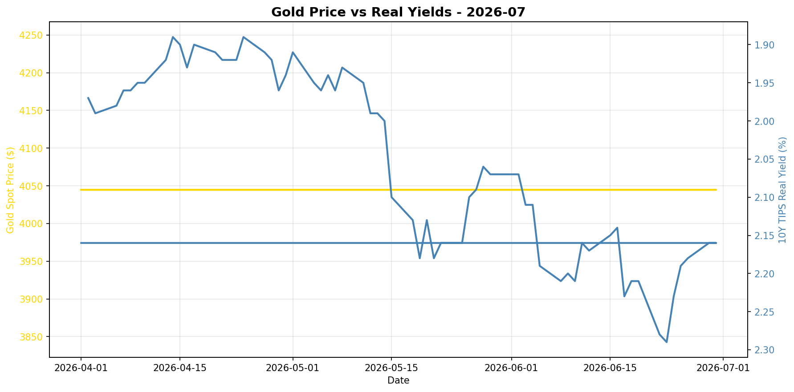
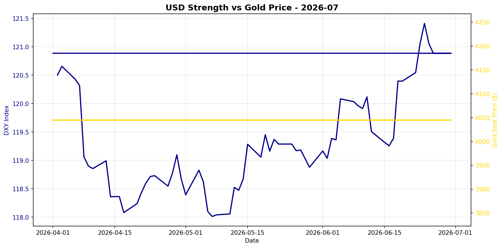

# Gold Market Monitor - July 2026

*Generated: 2026-07-01 12:13:43*

---

## Executive Summary

**1. What Changed**

Over the past 30 days, the most significant trend is the continued strength of the US Dollar, with the DXY rising by 1.34%, reinforcing its upward trajectory over the past 90 days. Despite this, real interest rates have remained stable, with the 10Y TIPS yield unchanged over the last month but significantly up by 14.29% over the past quarter. Notably, gold has not reacted dramatically to these shifts, maintaining its spot price at $4045.00 without significant movement, which suggests a potential decoupling from its usual inverse relationship with real yields.

**2. Why It Matters**

The strengthening US Dollar typically exerts downward pressure on gold prices by making it more expensive for foreign buyers, yet the stable real interest rates have provided a counterbalancing effect. Central bank activity, although stale, indicates moderate buying which historically supports gold prices but lacks immediacy given the data's age. This environment suggests a mixed macro regime where traditional pressures on gold are countered by factors like central bank buying and stable real yields, highlighting the importance of monitoring any shifts in these dynamics as they could quickly alter the overall trend.

**3. Position Implications**

Given the regime score of -0.75, the current macro environment presents mixed signals, leading to a neutral stance with a recommendation to hold the current position. While the strengthening dollar and rising real yields are bearish for gold, the lack of immediate central bank data and the stable gold price suggest that there is no urgent need to adjust positions. Key risks include potential shifts in US monetary policy that could further impact real yields or currency strength, while catalysts such as fresh central bank data could provide new insights into gold's trajectory. Continued monitoring of these factors is essential for timely decision-making.

---

## Regime Score: -0.8 / 10


```
Bearish                Neutral                Bullish
   -5         -3         0         +3         +5
    ────────█─┼──────────
```


**Assessment:** NEUTRAL  
**Conviction:** Mixed signals  
**Recommended Action:** Hold current position

### Score Components:

  ➖ **Real yields stable**: +0.0
  ❌ **USD strengthening**: -0.8
  ⚠️ **CB data stale (266 days)**: +0.0

**Methodology:**
- Real yields: ±2 points (primary driver)
- USD strength: ±1.5 points  
- Central bank buying: ±2 points
- Valuation: -1 point if overextended (z-score > 1.5)

*Score interpretation: >+3 = high conviction bullish | -1 to +1 = neutral | <-3 = bearish*

---

## Key Metrics

### Real Interest Rates (Primary Gold Driver)
- **10Y TIPS Yield:** 2.16%
- **30-Day Change:** +0.00%
- **90-Day Change:** +14.29%
- **Interpretation:** Rising real yields = bearish for gold

### US Dollar Strength
- **DXY Index:** 120.89
- **30-Day Change:** +1.34%
- **90-Day Change:** +2.14%
- **Interpretation:** Strengthening USD = bearish for gold

### Market Sentiment
- **VIX Index:** N/A
- **Geopolitical Risk Index:** N/A
- **Environment:** Normal risk levels

### Gold Valuation
- **Gold Spot Price:** $4045.00
- **30-Day Return:** +0.00%
- **Real Gold Price (CPI-Adjusted):** $3901.51
- **Real Gold Z-Score (5Y):** -0.45
  - *Fair value range*
- **Gold/S&P 500 Ratio:** 0.5394

### Investment Flows
- **GLD Shares Outstanding:** N/A
  - *Note: Changes in shares outstanding indicate net ETF inflows/outflows*
- **Breakeven Inflation:** 2.22%

---

## Central Bank Activity (Official Sector)

- **Latest Quarter:** Q2_2025
- **Net Purchases:** 166.5 tonnes
- **Source:** WGC
- **Last Updated:** 2025-10-08 00:00:00 ⚠️

⚠️ **Data is 266 days old - check for new WGC report**
- **Interpretation:** Moderate buying

**Context:** Central banks have been consistent net buyers since 2010, with accelerated purchases post-2022. This represents structural, long-term demand often tied to reserve diversification and de-dollarization efforts.

---


## Charts





---

## Data Sources & Quality

**Primary Sources:**
- Real yields, gold spot, DXY, S&P 500, CPI, GPR: [Federal Reserve Economic Data (FRED)](https://fred.stlouisfed.org/)
- VIX, ETF holdings: [Yahoo Finance](https://finance.yahoo.com/)
- Central bank purchases: [World Gold Council](https://www.gold.org/goldhub/research/gold-demand-trends)

**Data Window:**
- Start: 2025-07-01 00:00:00
- End: 2026-06-30 00:00:00
- Days: 364

**Calculation Date:** 2026-07-01 12:13:36.294696

---

## Notes

- This report is generated automatically for monthly position review
- Focus on sustained regime changes, not daily volatility
- Z-scores require 1+ years of history (5 years optimal)
- Central bank data updates quarterly with ~45-60 day lag
- For questions or issues, review logs or contact the maintainer

---

*Report generated by Gold Market Monitor v1.0*
*GitHub: [esseedoubleyou/goldmonitor](https://github.com/esseedoubleyou/goldmonitor)*
