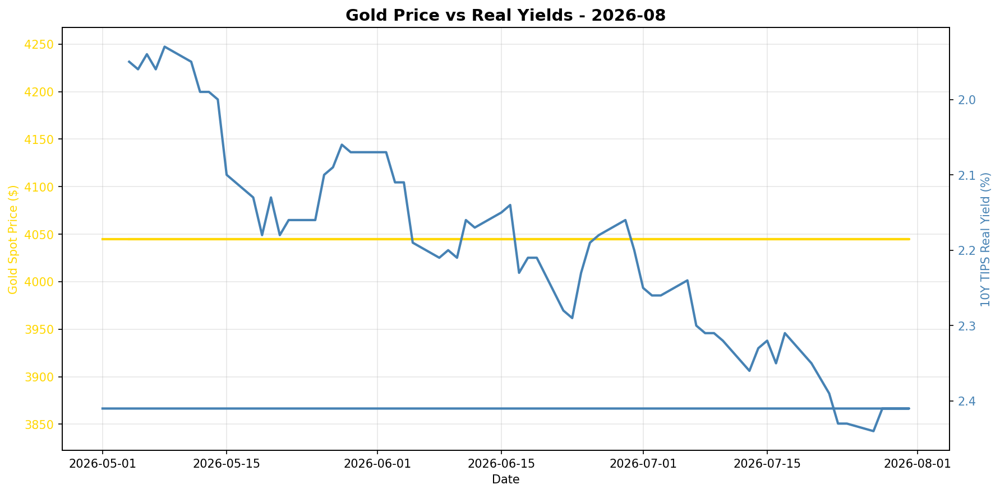
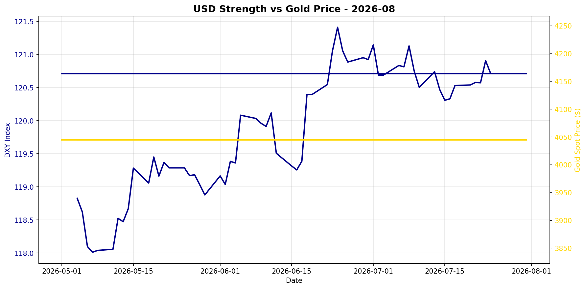

# Gold Market Monitor - August 2026

*Generated: 2026-08-01 10:44:56*

---

## Executive Summary

**1. What Changed**  
Over the past 30 days, real interest rates have increased significantly, with the 10-year TIPS yield rising by 10.05%, which is a continuation of a 90-day trend up by 13.15%. This sharp increase in real yields is a bearish signal for gold prices, as higher yields raise the opportunity cost of holding non-yielding assets like gold. Meanwhile, the US Dollar Index (DXY) has marginally weakened by 0.29% over the last month, which is typically bullish for gold. Despite this, the current gold price remains stable with a 30-day return of 0.00%, indicating resilience amidst rising yields.

**2. Why It Matters**  
The macro regime is influenced predominantly by rising real yields, which apply downward pressure on gold prices. This development signals a potential shift in investor preference away from gold as real rates offer more attractive returns. While the weakening USD typically supports gold, its impact appears minimal in comparison to the overriding influence of rising real yields. Additionally, stale central bank data limits insights on institutional demand, which could otherwise counterbalance the bearish pressure from real yields. The regime score of -1.25 reflects a mildly bearish outlook, underscoring the need for caution.

**3. Position Implications**  
Given the regime score of -1.25, which indicates a mildly bearish outlook, investors should consider maintaining or reducing exposure to gold. The strong upward trend in real yields presents a significant headwind that outweighs the minor weakening of the USD. Key risks to monitor include any potential shifts in central bank buying behavior, as fresh data could alter the demand landscape. Additionally, geopolitical risks, despite being normal, should be watched for unexpected changes that could influence market sentiment and gold's safe-haven appeal. Overall, the strategy should tilt towards caution, with an eye on yield trends and central bank activity for future positioning adjustments.

---

## Regime Score: -1.2 / 10


```
Bearish                Neutral                Bullish
   -5         -3         0         +3         +5
    ───────█──┼──────────
```


**Assessment:** MILDLY BEARISH  
**Conviction:** Caution warranted  
**Recommended Action:** Maintain or reduce exposure

### Score Components:

  ❌ **Real yields rising sharply**: -2.0
  ✅ **USD weakening**: +0.8
  ⚠️ **CB data stale (297 days)**: +0.0

**Methodology:**
- Real yields: ±2 points (primary driver)
- USD strength: ±1.5 points  
- Central bank buying: ±2 points
- Valuation: -1 point if overextended (z-score > 1.5)

*Score interpretation: >+3 = high conviction bullish | -1 to +1 = neutral | <-3 = bearish*

---

## Key Metrics

### Real Interest Rates (Primary Gold Driver)
- **10Y TIPS Yield:** 2.41%
- **30-Day Change:** +10.05%
- **90-Day Change:** +13.15%
- **Interpretation:** Rising real yields = bearish for gold

### US Dollar Strength
- **DXY Index:** 120.71
- **30-Day Change:** -0.29%
- **90-Day Change:** +1.39%
- **Interpretation:** Weakening USD = bullish for gold

### Market Sentiment
- **VIX Index:** N/A
- **Geopolitical Risk Index:** 285.3
- **Environment:** Normal risk levels

### Gold Valuation
- **Gold Spot Price:** $4045.00
- **30-Day Return:** +0.00%
- **Real Gold Price (CPI-Adjusted):** $3918.07
- **Real Gold Z-Score (5Y):** -0.28
  - *Fair value range*
- **Gold/S&P 500 Ratio:** 0.5401

### Investment Flows
- **GLD Shares Outstanding:** N/A
  - *Note: Changes in shares outstanding indicate net ETF inflows/outflows*
- **Breakeven Inflation:** 2.27%

---

## Central Bank Activity (Official Sector)

- **Latest Quarter:** Q2_2025
- **Net Purchases:** 166.5 tonnes
- **Source:** WGC
- **Last Updated:** 2025-10-08 00:00:00 ⚠️

⚠️ **Data is 297 days old - check for new WGC report**
- **Interpretation:** Moderate buying

**Context:** Central banks have been consistent net buyers since 2010, with accelerated purchases post-2022. This represents structural, long-term demand often tied to reserve diversification and de-dollarization efforts.

---


## Charts





---

## Data Sources & Quality

**Primary Sources:**
- Real yields, gold spot, DXY, S&P 500, CPI, GPR: [Federal Reserve Economic Data (FRED)](https://fred.stlouisfed.org/)
- VIX, ETF holdings: [Yahoo Finance](https://finance.yahoo.com/)
- Central bank purchases: [World Gold Council](https://www.gold.org/goldhub/research/gold-demand-trends)

**Data Window:**
- Start: 2025-07-01 00:00:00
- End: 2026-07-31 00:00:00
- Days: 395

**Calculation Date:** 2026-08-01 10:44:51.542124

---

## Notes

- This report is generated automatically for monthly position review
- Focus on sustained regime changes, not daily volatility
- Z-scores require 1+ years of history (5 years optimal)
- Central bank data updates quarterly with ~45-60 day lag
- For questions or issues, review logs or contact the maintainer

---

*Report generated by Gold Market Monitor v1.0*
*GitHub: [esseedoubleyou/goldmonitor](https://github.com/esseedoubleyou/goldmonitor)*
